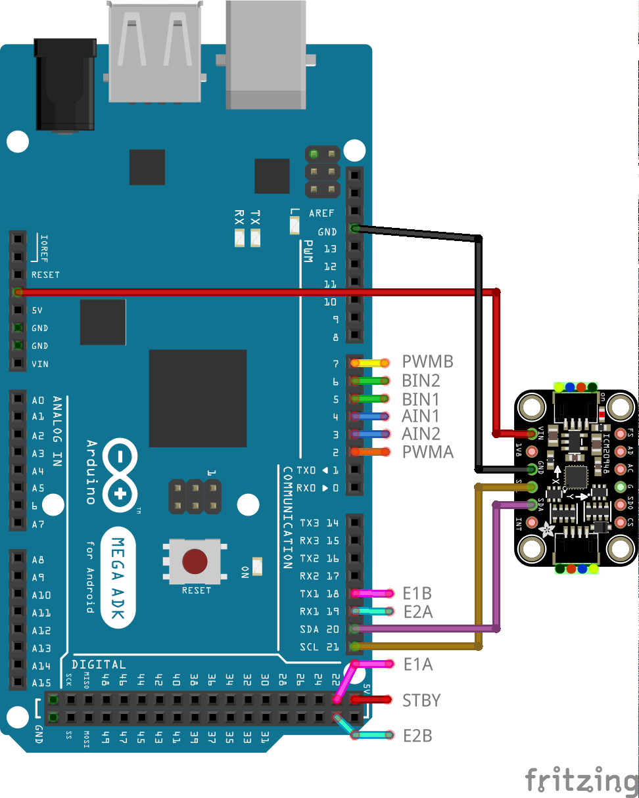

# Lab04: Odometry

## Learning Outcome

- Understand what odometry is.
- Can use IMU as a method of odometry.
- Can use wheel encoders as a method of odometry.
- Can operate the `ICM-20948` IMU sensor.

---

## Prerequisites

### Related Lectures

- Localisation I.
- Kinematics.

### Prelab Video

Mandatory:

- [Encoder odometry](https://unsw.sharepoint.com/:v:/s/CLS-MTRN3100_T2_5236_Combine/EWn_y-zn_ptIsYUAliuIZjUBPRcA4rdINytg9zNLhxHKEw?e=OQi1yl)

- [IMU odometry](https://unsw.sharepoint.com/:v:/s/CLS-MTRN3100_T2_5236_Combine/Ec6zfUV4kthJqj9TNezzYjgBLhjGwHjHIKJfnb7OXwi_aA?e=osZbia)

### Kit

This lab will require:

- $1 \times$ robot assembled with:
    - $1 \times$ Arduino MEGA
    - $2 \times$ motors with encoders
    - $1 \times$ motor driver
    - $1 \times$ battery pack
    - $1 \times$ `ICM-20948` IMU

---

## Prelab

1. (1 mark) What is odometry?

1. (2 marks) Wheel encoders and IMU are two examples of methods of odometry. Discuss why the IMU would yield more accurate position and/or velocity values over using encoder odometry.

1. (3 marks) Encoder odometry is an application of forward kinematics. Derive an expression for the robot's position i.e. `[x, y, h]` in the global frame from its wheel parameters.

    Let:
    - `thetaL` be the left wheel position.
    - `thetaR` be the right wheel position.
    - `L` be the axle length.
    - `R` be the wheel radius.

1. (4 marks) The IMU returns a linear acceleration vector `[ax, ay, az]` and angular velocity vector `[gx, gy, gz]` - both in the local frame.

    Derive an expression for the robot's linear velocity `[vx, vy, vz]` in the local frame.

    Derive an expression for the robot's pose `[x, y, h]` in the global frame.

    Let:
    - `dt` be the time between measurements.

---

## Lab

### Instruction

1. (required) Install the following libraries using the Arduino IDE library manager:
    - [ICM 20948 by SparkFun](https://github.com/sparkfun/SparkFun_ICM-20948_ArduinoLibrary)

1. (5 marks) Build the following circuit. Ensure all required components are assembled onto the mobile robot platform.

    Refer to lab02 for motor driver connections.

    

    Note that the orientation of the IMU must match the below diagram where:
    - `x` is the axis pointing to the front of the robot.
    - `y` is the axis pointing to the left of the robot.
    - `z` is the axis pointing up from the robot.

    

1. (required) Identify the axle length and wheel radius of the platform.

    These values will be required for forward kinematics.

1. (3 marks) Modify the `odometry` sketch so that the robot position can be obtained using wheel encoder odometry.

    Verify the robot position is correct by rolling the robot and printing the robot position to Serial Monitor.

    The position is a vector in the global frame: `[x, y, h]`.

    You will need to copy your completed `Encoder` class into this sketch.

1. (3 marks) Modify the `odometry` sketch so that the robot position can be obtained using IMU odometry.

    Verify the robot position is correct by rolling the robot and printing the robot position to Serial Monitor.

    You will need to complete the `IMU` class.

    You may wish to look at the examples in the [ICM 20948 by SparkFun GitHub](https://github.com/sparkfun/SparkFun_ICM-20948_ArduinoLibrary).

1. (2 marks) Explain any discrepancies between the truth, encoder, and IMU **position** data.

1. (required) Individually answer a demo question orally. The mark from this question will scale your lab mark.

1. (0 marks) Modify the `odometry` sketch so that the robot is driven autonomously like in the given `drive_by_command` sketch.

    You will need to copy your completed `Encoder` and `Motor` classes into this sketch.

