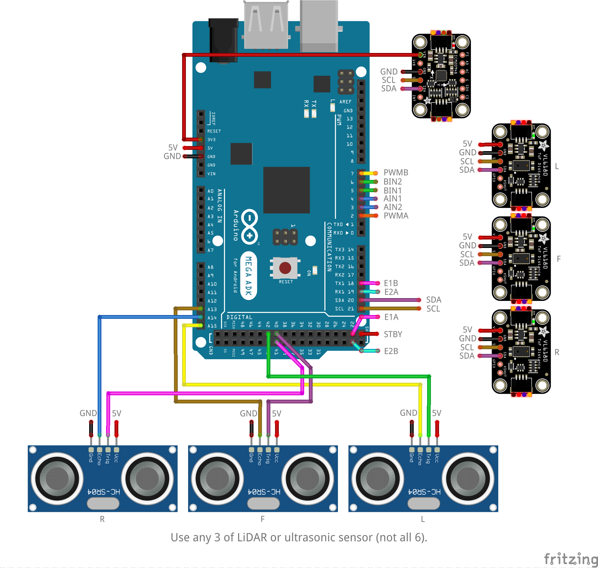

# Lab08: Maze Mapping

## Learning Outcome

- Can design a complex robot program that is autonomous.
- Can utilise given data structures to implement a map.
- Combine concepts/techniques from previous labs to implement a complex robot program.

---

## Prerequisites

### Prelab Video

No prelab videos this week.

### Kit

This lab will require:

- $1 \times$ robot assembled with:
    - $1 \times$ Arduino MEGA.
    - $2 \times$ motors with encoders.
    - $1 \times$ motors driver.
    - $1 \times$ battery pack.
    - $1 \times$ IMU (optional).
    - $1 \times$ front-facing distance sensor (ultrasonic or LiDAR).
    - $1 \times$ left-facing distance sensor (ultrasonic or LiDAR).
    - $1 \times$ right-facing distance sensor (ultrasonic or LiDAR).

---

## Prelab

1. (3 marks) Complete the function `graph2ascii` in `graph2ascii.hpp` which visualises a graph with ASCII art e.g.:
    ```
     --- --- --- 
    |           |
         ---     
    |           |
         ---     
    |       |   |
     --- --- --- 
    ```

    Test `graph2ascii` against `test_graph2ascii.cpp` and submit `graph2ascii.hpp` when complete.

    Use the following command when compiling:
    ```
    g++ -std=c++11 -Wall -Wextra -Werror -Wuninitialized test_graph2ascii.cpp
    ```

    To run the executable:
    ```py
    a.out  # MacOS and Linux
    a.exe  # Windows
    ```
    
    Each cell is identified by an index in the following order:
    ```py
     --- --- ---
    | 1 | 2 | 3 |
     --- --- ---
    | 4 | 5 | 6 |
     --- --- ---
    | 7 | 8 | 9 |
     --- --- ---
    ```

    Avoid using the C++ `std` library as Arduino does not support it. Prefer to use C libraries instead.


---

## Lab


### Instruction

1. (required) Install the following libraries using the Arduino IDE library manager.

    These libraries are only required if you are going to use LiDARs for distance sensing:
    - [VL6180X by Polulu](https://github.com/pololu/vl6180x-arduino)
    - [VL53L0X by Polulu](https://github.com/pololu/vl53l0x-arduino)

1. (3 marks) Build the robot platform. Ensure all required components are assembled onto the mobile robot platform.

    Any type of distance sensors may be used as long as the robot has three distance sensors facing the front, left, and right sides.

    


1. (3 marks) Implement the `walls` sketch so that the robot is able to detect the presence of the surrounding walls on its front, left, and right sides if the robot was placed in the centre of a cell.

    Print the data to Serial Monitor in the following format where `1` is detected and `0` is not detected:
    ```
    F: 1, L: 0, R: 0
    ```

    Let the distance threshold be `150 mm`. If there is an obstacle within this threshold, the obstacle is considered detected.


1. (9 marks) Implement the `maze_mapping` sketch so that the robot drives around a `3 x 3` maze and maps the walls using its front, left, and right sensors.

    Use a completed sketch from a previous lab which implements robot movement such that it makes one motion at a time i.e. `F` or `L` or `R`. Valid sketches are:
    - `drive_by_command`
    - `drive_by_pose`
    - `closed_drive_by_pose`

    Come up with your own drive plan so that the robot will visit each cell of the maze.

    Integrate the `walls` sketch into the `maze_mapping` sketch to detect the walls.


1. (4 marks) Modify the `maze_mapping` sketch so that a graph is used to keep track of which cells are connected.

    Verify the graph has been correctly generated by using `graph2ascii()` or `Graph::edges()`.

    Use the `Graph` data structure to represent the maze.

    Note that odometry will be required to know which cell the robot is currently in (and facing) to know which cells are connected.


1. (required) Individually answer a demo question orally. The mark from this question will scale your lab mark.

